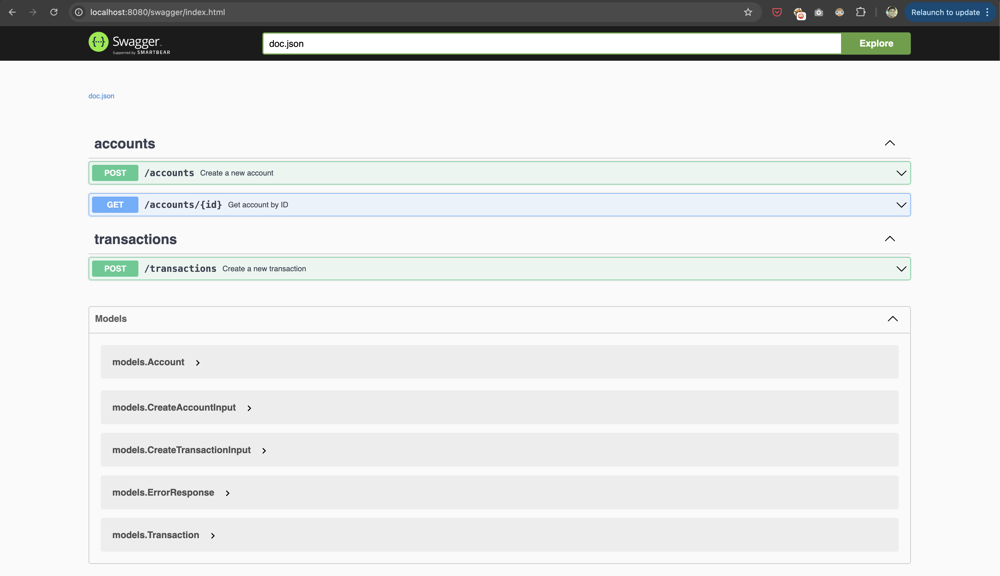

# 🏦 Bank API

A RESTful API for managing customer accounts and transactions.

## 🛠️ Tech Stack

This project is built using:

- **Go** - Go v1.23
- **net/http** – Go’s standard HTTP library
- **PostgreSQL** – RDBMS used to store account and transaction data
- **database/sql + lib/pq** – Go packages used to connect to and query the PostgreSQL database
- **http-swagger** – Go package for creating and showing API documentation using swagger
- **Docker + Docker Compose** – Containerizing the application. Spins up the API and database together
- **httptest** – Go package for writing api tests


## 📦 Features

- Create and retrieve customer accounts
- Create transactions
- PostgreSQL persistence
- Swagger API documentation
- Automated tests
- Dockerized setup using docker compose

## 🔧 Prerequisites

- Go 1.23+
- Docker + Docker Compose
- `swag` CLI tool for generating docs. Install using ```go install github.com/swaggo/swag/cmd/swag@latest```

## 🐳 Running the App using Docker Compose

```docker-compose up --build```

This will:

- Build and start the Go api
- Create the PostgreSQL database used by the api
- Initialize the database by creating required tables and seeding data
- Create the PostgreSQL database used by the tests
- Initialize the test database by creating required tables and seeding data
- Start the API server on http://localhost:8080

## 🧪 Running Tests

Make sure the app is running. I have created a Makefile target which can be used as follows to run all the tests:

```make test```

## 📘 Swagger API Documentation

Once the api is running, navigate to `http://localhost:8080/swagger/index.html` to view the API documentation.

